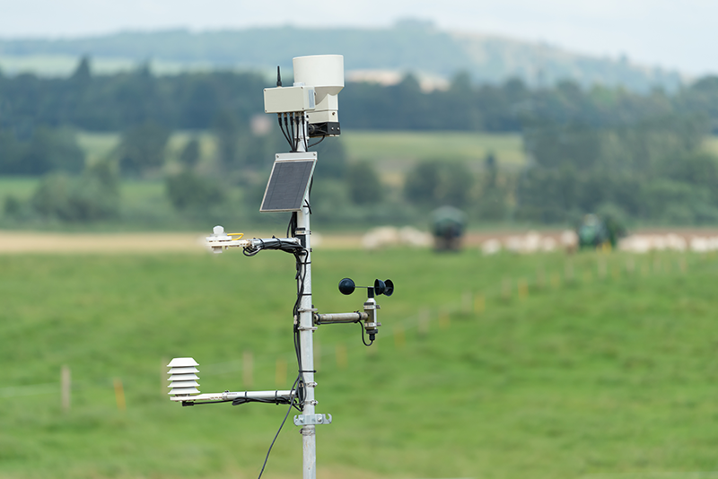
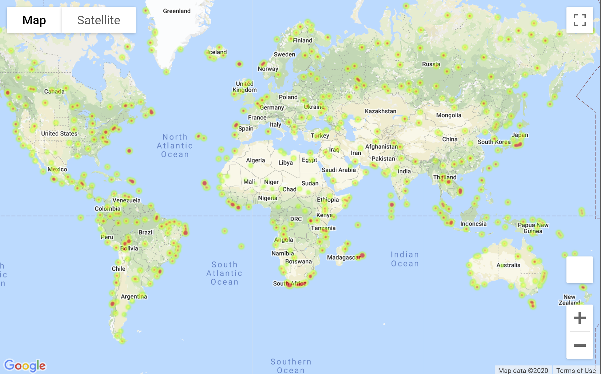
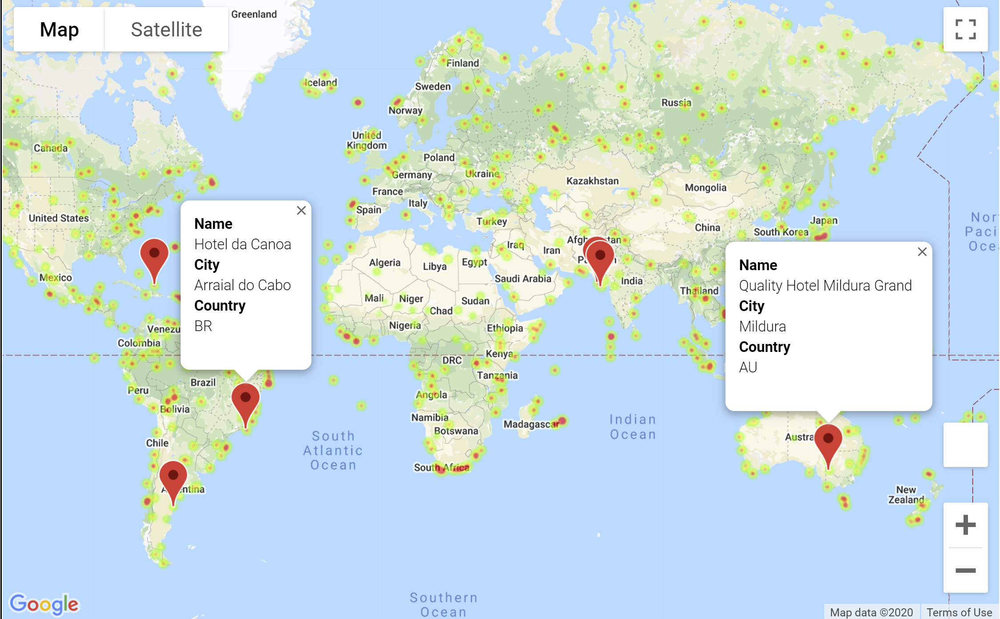

# WeatherPy
----
This notebook will be creating a Python script to visualize the weather of 500+ cities across the world of varying distance from the equator. To accomplish this, we'll be utilizing a [simple Python library](https://pypi.python.org/pypi/citipy), the [OpenWeatherMap API](https://openweathermap.org/api), and a little common sense to create a representative model of weather across world cities.

We will seek to find if there is a correlation between one of four weather measures and latitude. The four weather measures are Temperature, Humidity, Cloudiness and Wind Speed. Imperial units will be utilized.

Our first analysis will examine all latitudes against each weather measure. Then we will segment our dataset into Northern and Southern Hemisphere data and see if we are able to get a stronger correlation to the weather measures.

This final notebook will contain:

* At least 500 randomly selected unique (non-repeat) cities based on latitude and longitude.
* A weather check on each of the cities found randomly using a series of successive API calls to Openweather.org.
* A printed log of each city as it's being processed with the city ID and city name.
* A saved CSV file of all retrieved data
* A PNG image for each scatter plot (saved in the "Figures" folder)

# Analysis and observations

Of the four weather measures examined versus changes in latitude the strongest correlation was found between Northern Hemisphere changes in latitude versus temperature. This relationship had a high r-squared value of 0.87 meaning that 87% of the variance in this data could be explained by the equation of the line from linear regression. 

Of the relationships examined there were some weak correlations with r-squared values of around 0.4 and others below that - which indicated that there wasn't a correlation:
* Northern Hemisphere - Temperature (F) vs. Latitude     r-squared -0.87
* Southern Hemisphere - Temperature (F) vs. Latitude     r-squared  0.42     
* Northern Hemisphere - Humidity (%) vs. Latitude        r-squared  0.29
* Southern Hemisphere - Humidity (%) vs. Latitude        r-squared  0.42
* Northern Hemisphere - Cloudiness (%) vs. Latitude      r-squared  0.19
* Southern Hemisphere - Cloudiness (%) vs. Latitude      r-squared  0.39
* Northern Hemisphere - Wind Speed (mph) vs. Latitude    r-squared  0.07
* Southern Hemisphere - Wind Speed (mph) vs. Latitude    r-squared -0.41

Some observable trends based on this data:

* Temperature decreases as you move north from the equator in the Northern Hemisphere in strongly linear fashion
* Temperature decreases as you move south from the equator in the Southern Hemisphere in a weak linear fashion
* In the Northern Hemisphere Humidity is very weakly correlated to increase as you increase in latitude
* In the Southern Hemisphere Humidity is weakly correlated to decrease as you move south in latitude
* Cloudiness is not correlated to latitude in the Northern Hemisphere
* Cloudiness is weakly correlated to decrease as you move south in latitude in the Southern Hemisphere
* Wind Speed is not correlated to latitude in the Northern Hemisphere
* In the Southern Hemisphere, Wind Speed is weakly correlated to increase as you move south in latitude

# VacationPy
----
This Jupyter notebook will work with weather data to plan future vacations. We will use jupyter-gmaps and the Google Places API to find cities from the WeatherPy notebook results that have the ideal weather for a vacation spot. Then we will plot out markers on a map of the world and find a hotel we can stay at in those cities. 

* Create a heat map that displays the humidity for every city from the part I of the homework.

  

* Narrow down the DataFrame to find your ideal weather condition. For example:

  * A max temperature lower than 80 degrees but higher than 70.

  * Wind speed less than 10 mph.

  * Zero cloudiness.

  * Drop any rows that don't contain all three conditions. You want to be sure the weather is ideal.

  * **Note:** Feel free to adjust to your specifications but be sure to limit the number of rows returned by your API requests to a reasonable number.

* Using Google Places API to find the first hotel for each city located within 5000 meters of your coordinates.

* Plot the hotels on top of the humidity heatmap with each pin containing the **Hotel Name**, **City**, and **Country**.

  